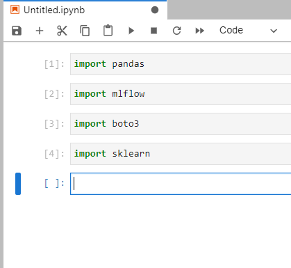

# Create conda virtual environment

## 1. Create an environment
`  conda create --name ds-dev python=3.8 ` 

` Proceed ([y]/n)? y ` 

## 2. Activate env
` conda activate ds-dev `  

### 2.1. List conda environments
```commandline
conda env list
```
- Output
```
#
base                  *  /home/train/miniconda3
ds-dev                   /home/train/miniconda3/envs/ds-dev
```
## 3. Install basic datascience packages
```commandline
pip install -r requirements.txt
```

## 4. Install virtualenv kernel to Jupyter
` ipython kernel install --user --name=ds-dev ` 

## 5. Start Jupyter Lab
- Start
`  jupyter lab --ip 0.0.0.0 --port 8990 ` 

- Copy link
http://127.0.0.1:8990/lab?token=d137758b0014e1745f1946a91083e1256be7ff9051a4a95c


## 6. Port Forwarding
- Virtualbox


## 7. Open Jupyter lab and create notebook
- Paste the notebook link to browser
- Create a notebook  


### 7.1. Import test



---

### 7.2. Close jupyter lab
- On jupyter lab terminal press `Ctrl+C`

## 8. Removing environments
```commandline
conda env remove --name <env-name>
```


