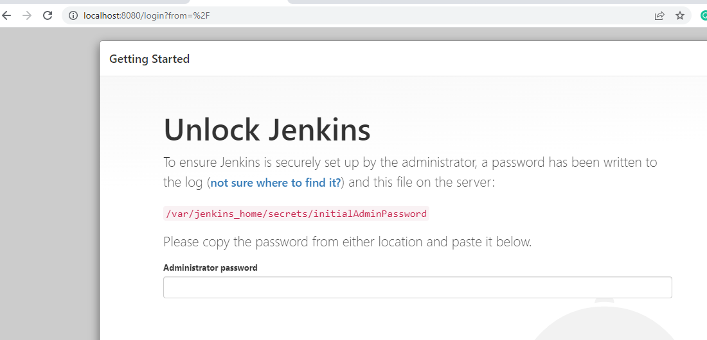
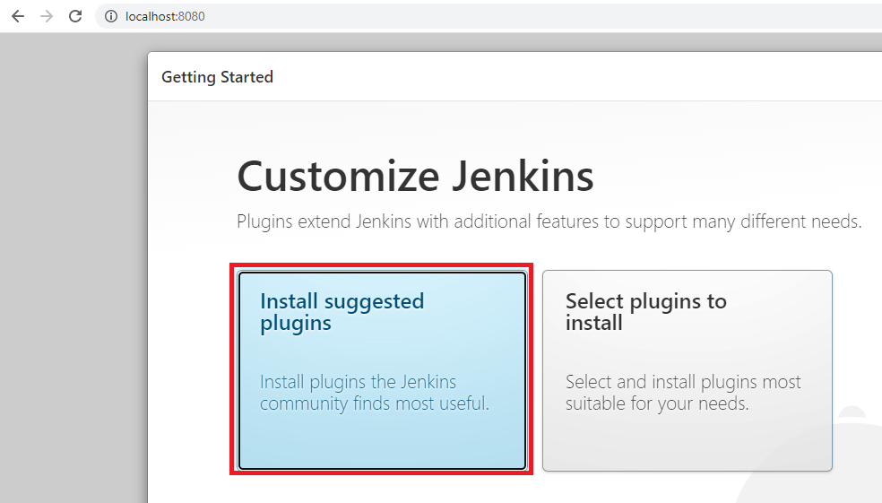
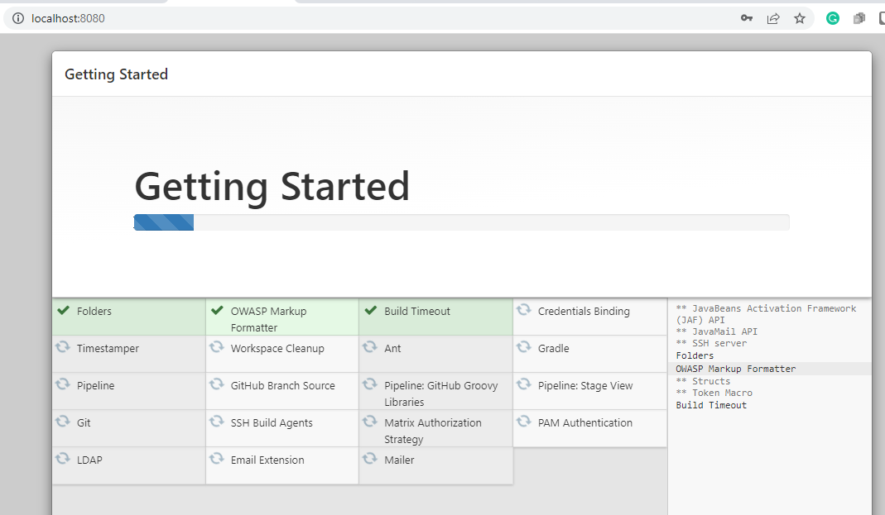
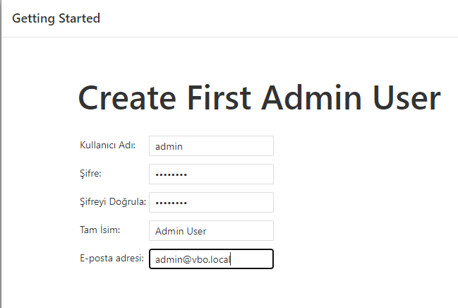
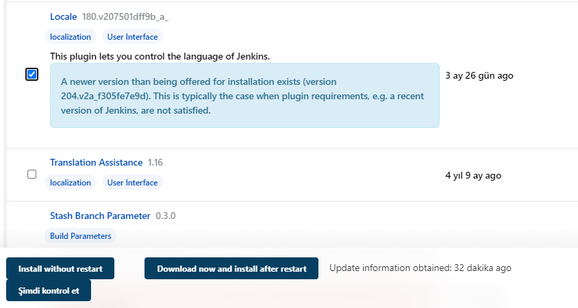
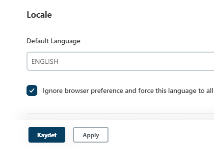

## 1. Run Jenkins
- We will use docker-compose contains mlflow, gitea, minio etc.

```commandline
cd ~/mlops_docker

docker-compose up --build -d jenkins
```

## 2. Virtualbox port forwarding
8080 -> 8080

## 3. Jenkins password 
- Open browser 
- http://127.0.0.1:8080
- You will see:


---------------------------------------


## 4. Learn token
- On terminal

` docker exec -it jenkins cat /var/jenkins_home/secrets/initialAdminPassword `
 
Expected output will be like this (Yours can be different):   
` 0232a2abd5b3418a9d2a1215fcdd9b6a `

- Paste this on UI Administrator password box

## 5. Install suggested plugins

 


----------------------------------

It may take 10-15 mins



---------------------------

## 6. Create admin user


----------------------------

- Click Save & Finish

## 7. Change Jenkins language
### 7.1. Install locale plugin
- Jenkins'i Yönet -> 
- Eklentileri Yönet -> 
- Kullanılabilir (Tab) -> 
- Search for **locale** -> 
- Select plugin -> 
- Download and restart -> 
- Yükleme tamamlandığında yeniden başlat



---
### 7.2. Configure locale language
- Jenkins'i Yönet -> 
- Sistem Konfigürasyonunu Değiştir -> 
- in Locale box type **ENGLISH** -> 
- Check Ignore browser preference and force this language to all users -> Kaydet -> You will see UI in English now.



---


