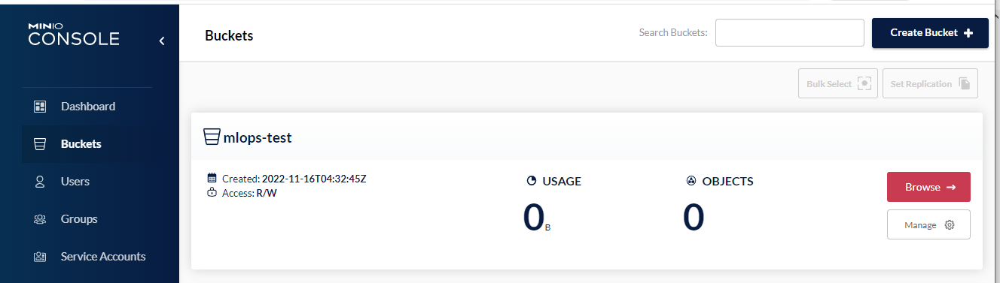

# Install AWS CLI on CentOS7

## 1. Install 
```
cd ~
sudo yum -y install unzip
curl "https://awscli.amazonaws.com/awscli-exe-linux-x86_64.zip" -o "awscliv2.zip"
unzip awscliv2.zip
sudo ./aws/install
```

## 2. Check version
```
(base) [train@localhost ~]$ aws --version
```
- Expected output

` aws-cli/2.4.19 Python/3.8.8 Linux/3.10.0-1160.53.1.el7.x86_64 exe/x86_64.centos.7 prompt/off `

## 3. Learn Region


-----------------------------------------------

## 4. Configure with profile
- We will configure both MinIO and AWS. MinIO will be `default` and AWS will be `aws` profile. You can use another name instead aws.
```commandline
# MinIO
(ds-dev) [train@localhost ~]$ aws configure
AWS Access Key ID [None]: trainkey
AWS Secret Access Key [None]: trainsecret
Default region name [None]: 
Default output format [None]: json

# AWS
(ds-dev) [train@localhost ~]$ aws configure --profile aws
AWS Access Key ID [None]: aws-key-id
AWS Secret Access Key [None]: aws-secret-access-key
Default region name [None]: eu-central-1
Default output format [None]: json

# Credentials file
(ds-dev) [train@localhost ~]$ cat ~/.aws/credentials
[default]
aws_access_key_id = trainkey
aws_secret_access_key = trainsecret
[aws]
aws_access_key_id = aws-key-id
aws_secret_access_key = aws-secret-access-key
```

## 5. Create a bucket on AWS
```
aws s3api create-bucket \
--bucket vbo-mlops-bootcamp \
--create-bucket-configuration LocationConstraint=eu-central-1
```

## 6. Check bucket from AWS Web Console


-----------------------------------------------

## 7. Upload a file from local
```
echo "AWS S3 bucket test" > test.txt
aws s3 cp test.txt s3://vbo-mlops-bootcamp/s3-tests/test.txt
```

## 8. Check uploaded file


-----------------------------------------------

## 9. Create a bucket on MinIO
- Run MinIO container
`  docker-compose up -d minio `
### Create bucket
```commandline
aws s3api create-bucket \
--bucket mlops-test \
--endpoint http://localhost:9000
```
- Output:
```commandline
{
    "Location": "/mlops-test"
}
```
- Check from MinIO Web UI



---

### List MinIO buckets
```commandline
 aws s3 ls --endpoint http://localhost:9000
```
- Output
```commandline
2022-11-16 07:32:45 mlops-test
2022-11-15 05:20:09 vbo-mlflow-bucket
```

## Delete MinIO Bucket
```commandline
aws s3api delete-bucket --bucket mlops-test \
--endpoint http://localhost:9000
```